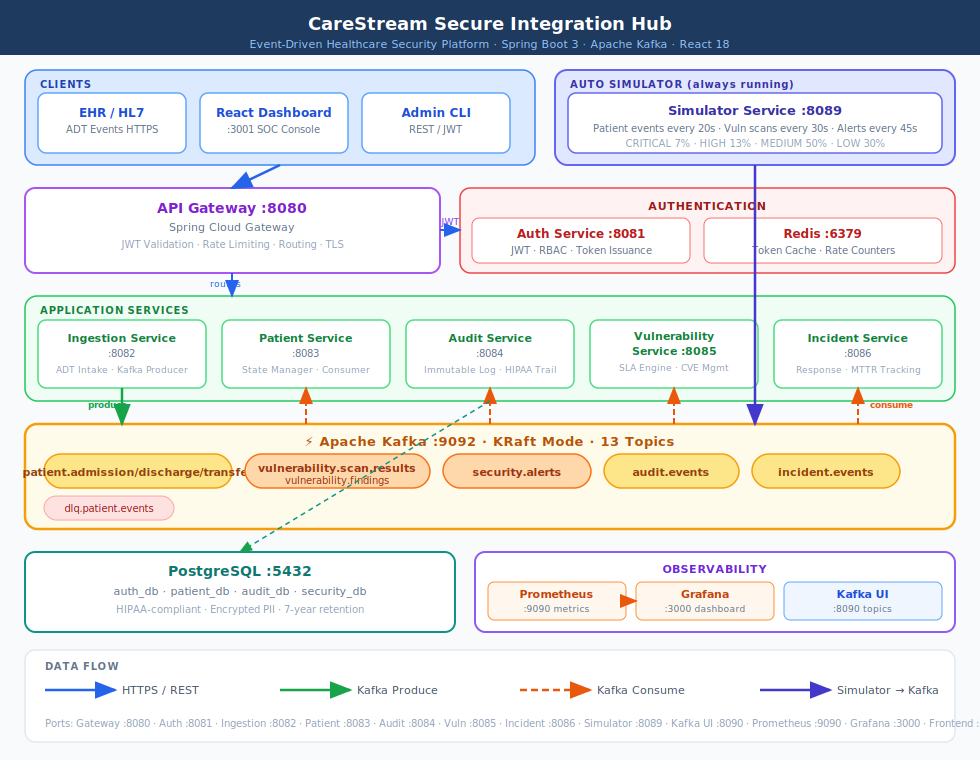

# CareStream Secure Integration Hub — High-Level Design

## 1. System Overview

CareStream is a **distributed, event-driven healthcare integration platform** that streams
patient ADT (Admit/Discharge/Transfer) events in real time, enforces HIPAA-grade security,
and provides a Security Operations layer with vulnerability management, threat detection,
and incident response — with a built-in real-time event simulator that auto-generates
realistic healthcare data continuously.

---

## 2. Architecture Diagram



> **How to read this diagram:**
> - **Blue arrows** — HTTPS/REST calls (Client → Service)
> - **Green arrows** — Kafka produce (Service → Topic)
> - **Orange dashed arrows** — Kafka consume (Topic → Service)
> - **Indigo arrows** — Simulator producing directly to Kafka topics
> - **Teal dashed lines** — Database read/write
> - **Grey dotted lines** — Prometheus metrics scraping

---

## 3. Microservices Breakdown

| Service | Port | Responsibility | Technology |
|---|---|---|---|
| **API Gateway** | 8080 | JWT validation, routing, rate limiting, TLS termination | Spring Cloud Gateway 4.x |
| **Auth Service** | 8081 | User auth, JWT issuance, RBAC, token refresh | Spring Boot 3 + Spring Security |
| **Ingestion Service** | 8082 | Receive ADT events, validate, publish to Kafka | Spring Boot 3 + Kafka Producer |
| **Patient Service** | 8083 | Consume events, maintain patient state | Spring Boot 3 + Kafka Consumer |
| **Audit Service** | 8084 | Immutable event log, compliance trail | Spring Boot 3 + Kafka Consumer/Producer |
| **Vulnerability Service** | 8085 | Scan simulation, SLA engine, remediation tracking | Spring Boot 3 + Kafka Consumer/Producer |
| **Incident Service** | 8086 | Incident lifecycle, threat detection, MTTR tracking | Spring Boot 3 + Kafka Consumer/Producer |
| **Simulator Service** | 8089 | Real-time event generator — runs automatically | Spring Boot 3 + `@Scheduled` |

### Infrastructure Components

| Component | Port | Purpose |
|---|---|---|
| **Apache Kafka** | 9092 | Event bus — KRaft mode (no ZooKeeper) |
| **PostgreSQL** | 5432 | Persistent storage — 4 logical databases |
| **Redis** | 6379 | JWT token cache, rate limit counters |
| **Prometheus** | 9090 | Metrics scraping — `carestream_*` gauges |
| **Grafana** | 3000 | SOC Dashboard — 5 alert rules provisioned |
| **Kafka UI** | 8090 | Topic browser and live message inspector |
| **React Frontend** | 3001 | SOC console — auto-polls every 30 seconds |

---

## 4. Kafka Topics

| Topic | Partitions | Producer | Consumer |
|---|---|---|---|
| `patient.admission` | 3 | Ingestion Service, Simulator | Patient Service, Audit Service |
| `patient.admission-retry-0,1,2` | 1 | Patient Service (retry) | Patient Service |
| `patient.discharge` | 3 | Ingestion Service, Simulator | Patient Service, Audit Service |
| `patient.discharge-retry-0` | 1 | Patient Service (retry) | Patient Service |
| `patient.transfer` | 3 | Ingestion Service, Simulator | Patient Service, Audit Service |
| `patient.transfer-retry-0` | 1 | Patient Service (retry) | Patient Service |
| `vulnerability.scan.results` | 3 | **Simulator Service** | Vulnerability Service |
| `vulnerability.findings` | 3 | Vulnerability Service | (downstream consumers) |
| `security.alerts` | 3 | Simulator, Vulnerability Service (CRIT/HIGH) | Incident Service |
| `incident.events` | 3 | Incident Service | (audit, notifications) |
| `audit.events` | 3 | Audit Service | (compliance trail) |
| `dlq.patient.events` | 1 | Ingestion Service (on failure) | (manual inspection) |
| `__consumer_offsets` | — | Kafka internal | Kafka internal |

---

## 5. Real-Time Simulator Schedule

The `simulator-service` starts automatically and produces events on this cadence:

| Interval | Event Type | Kafka Topic(s) | Severity Distribution |
|---|---|---|---|
| Every **20s** | 2–4 Patient ADT events | `patient.admission`, `patient.discharge`, `patient.transfer` | N/A |
| Every **30s** | 1–2 Vulnerability findings | `vulnerability.scan.results` | CRIT 7%, HIGH 13%, MED 50%, LOW 30% |
| Every **45s** | 1 Security alert | `security.alerts` | CRIT 10%, HIGH 20%, MED 45%, LOW 25% |
| Every **60s** | 1 Scan pulse finding | `vulnerability.scan.results` | Realistic weighted (20% chance HIGH/CRIT) |

---

## 6. Technology Stack

| Layer | Technology | Rationale |
|---|---|---|
| Runtime | Java 17 LTS | Enterprise standard for healthcare systems |
| Framework | Spring Boot 3.2 | Production-ready, Spring Security, Actuator |
| API Gateway | Spring Cloud Gateway | Built-in circuit breaker, filters, JWT integration |
| Event Bus | Apache Kafka 3.6 (KRaft) | High-throughput, durable, partitioned streaming |
| Database | PostgreSQL 15 | ACID compliance, HIPAA audit trail support |
| Cache | Redis 7 | JWT token store, rate limiting counters |
| Container | Docker + Docker Compose | Reproducible environments, 15 services |
| Frontend | React 18 + TypeScript | Real-time SOC dashboard, 30s polling |
| Observability | Prometheus + Grafana | Metrics scraping + SOC dashboard + 5 alert rules |
| Message Browser | Kafka UI | Live topic inspection |
| Docs | OpenAPI 3.0 (Springdoc) | Auto-generated Swagger UI |

---

## 7. Security Architecture

```
┌─────────────────────────────────────────────────────────┐
│                    Security Layers                       │
│                                                         │
│  Layer 1 — Transport   TLS 1.3 on all endpoints        │
│  Layer 2 — Auth        JWT (RS256) signed tokens        │
│  Layer 3 — AuthZ       RBAC (ADMIN / DOCTOR / SERVICE) │
│  Layer 4 — Gateway     Rate limiting, IP allowlisting   │
│  Layer 5 — Data        Encrypted at rest (AES-256)     │
│  Layer 6 — Audit       Immutable event log              │
│  Layer 7 — SecOps      Vuln mgmt + Threat detection    │
└─────────────────────────────────────────────────────────┘
```

### Roles & Permissions

| Role | Permissions |
|---|---|
| `ADMIN` | Full access — user management, vuln management, incident management |
| `DOCTOR` | Read patient data, create ADT events, view own audit trail |
| `SERVICE` | Service-to-service calls, publish events (machine identity) |

---

## 8. Data Flow — End-to-End

### A. Patient ADT Flow (Manual via API)

```
EHR System
    │
    │  POST /adt-event  (Bearer JWT)
    ▼
API Gateway ──── JWT Validation ──── Auth Service ──── Redis
    │                                                    (token cache)
    │  [authorized]
    ▼
Ingestion Service
    │  1. Validate payload (HL7 FHIR-style schema)
    │  2. Enrich with metadata (timestamp, correlationId)
    │  3. Publish to Kafka topic (partitioned by patientId)
    │  4. On failure → publish to dlq.patient.events
    ▼
Kafka Broker
    ├──► patient.admission  ──►  Patient Service  ──►  patient_db
    │                       ──►  Audit Service    ──►  audit_db  ──►  audit.events
    │
    ├──► patient.discharge  ──►  (same consumers)
    │
    └──► patient.transfer   ──►  (same consumers)
```

### B. Vulnerability Scan Flow (Simulator Auto-Generates)

```
Simulator Service  (every 30s)
    │
    │  Publishes scan result JSON
    ▼
vulnerability.scan.results  topic
    │
    ▼
Vulnerability Service
    │  1. Idempotency check (findingId exists?)
    │  2. Save to security_db
    │  3. Calculate SLA deadline by severity
    │  4. Publish to vulnerability.findings
    │  5. If CRITICAL or HIGH → also publish to security.alerts
    ▼
security.alerts  topic
    │
    ▼
Incident Service
    │  1. Parse alert type + severity
    │  2. Create incident record
    │  3. Publish lifecycle event to incident.events
    ▼
security_db  (incidents table)
```

### Where Security is Enforced

| Point | Enforcement |
|---|---|
| API Gateway ingress | JWT signature verification, rate limiting |
| Every service | Role check via `@PreAuthorize` |
| Kafka producer | Service identity token required |
| Database | Encrypted columns for PII (name, DOB, SSN) |
| Audit log | Write-once, append-only table |
| Vulnerability engine | Continuous scan simulation, SLA enforcement |

---

## 9. SLA Policy

| Severity | SLA Window | Action on Breach |
|---|---|---|
| **CRITICAL** | 24 hours | Fires `security.alerts`, triggers Grafana alert |
| **HIGH** | 7 days | Escalated to incident queue |
| **MEDIUM** | 30 days | Tracked in dashboard |
| **LOW** | 90 days | Compliance logging only |

---

## 10. Non-Functional Requirements

| NFR | Target |
|---|---|
| Throughput | 10,000 ADT events/min |
| Latency (p99) | < 200ms end-to-end (gateway → Kafka publish) |
| Availability | 99.9% (multi-AZ on AWS) |
| RPO | < 1 minute (Kafka replication) |
| RTO | < 5 minutes (ECS task restart) |
| Audit retention | 7 years (HIPAA requirement) |
| Real-time updates | New events visible in dashboard within 30 seconds |
| Simulator cadence | Patient events every 20s, vuln scans every 30s |

---

## 11. Observability

### Prometheus Metrics (carestream_* namespace)

| Metric | Type | Description |
|---|---|---|
| `carestream_vulnerabilities_open` | Gauge | Current open vulnerability count |
| `carestream_vulnerabilities_critical` | Gauge | CRITICAL open count |
| `carestream_sla_compliance_percent` | Gauge | % of findings within SLA |
| `carestream_findings_ingested_total` | Counter | Total scan findings processed |
| `carestream_incidents_open` | Gauge | Active unresolved incidents |
| `carestream_incidents_created_total` | Counter | Total incidents ever created |
| `carestream_threat_events_received_total` | Counter | Total security alerts processed |

### Grafana Alert Rules (Pre-Provisioned)

| Alert | Condition | Severity |
|---|---|---|
| CRITICAL Vulnerabilities Detected | Any CRITICAL finding open | Critical |
| SLA Compliance Below 90% | `carestream_sla_compliance_percent` < 90 | Warning |
| SLA Breach Rate High | Breach rate > threshold | Warning |
| Vulnerability Ingestion Spike | > 20 findings in 5 minutes | Info |
| Vulnerability Backlog Critical | > 50 open findings | Warning |
