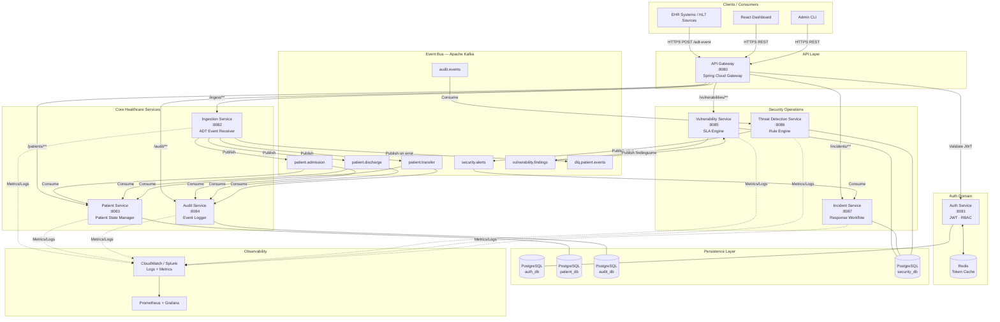

# CareStream Secure Integration Hub — High-Level Design

## 1. System Overview

CareStream is a **distributed, event-driven healthcare integration platform** that streams
patient ADT (Admit/Discharge/Transfer) events in real time, enforces HIPAA-grade security,
and provides a Security Operations layer with vulnerability management, threat detection,
and incident response.

---

## 2. Architecture Diagram



---

## 3. Microservices Breakdown

| Service | Port | Responsibility | Technology |
|---|---|---|---|
| **API Gateway** | 8080 | JWT validation, routing, rate limiting, TLS termination | Spring Cloud Gateway 4.x |
| **Auth Service** | 8081 | User auth, JWT issuance, RBAC, token refresh | Spring Boot 3 + Spring Security |
| **Ingestion Service** | 8082 | Receive ADT events, validate, publish to Kafka | Spring Boot 3 + Kafka Producer |
| **Patient Service** | 8083 | Consume events, maintain patient state | Spring Boot 3 + Kafka Consumer |
| **Audit Service** | 8084 | Immutable event log, compliance trail | Spring Boot 3 + Kafka Consumer |
| **Vulnerability Service** | 8085 | Scan simulation, SLA engine, remediation tracking | Spring Boot 3 |
| **Threat Detection Service** | 8086 | Log analysis, rule-based alerts | Spring Boot 3 + Kafka Consumer/Producer |
| **Incident Service** | 8087 | Incident lifecycle, workflow, notifications | Spring Boot 3 |

---

## 4. Technology Stack

| Layer | Technology | Rationale |
|---|---|---|
| Runtime | Java 17 LTS | Enterprise standard for healthcare systems |
| Framework | Spring Boot 3.2 | Production-ready, Spring Security, Actuator |
| API Gateway | Spring Cloud Gateway | Built-in circuit breaker, filters, JWT integration |
| Event Bus | Apache Kafka 3.6 | High-throughput, durable, partitioned streaming |
| Database | PostgreSQL 15 | ACID compliance, HIPAA audit trail support |
| Cache | Redis 7 | JWT token store, rate limiting counters |
| Container | Docker + Docker Compose | Reproducible environments |
| Cloud | AWS ECS + RDS + MSK | Production deployment |
| Frontend | React 18 + TypeScript | Real-time dashboard via WebSocket |
| Observability | Prometheus + Grafana + CloudWatch | Metrics + logs + alerts |
| Docs | OpenAPI 3.0 (Springdoc) | Auto-generated Swagger UI |

---

## 5. Security Architecture

```
┌─────────────────────────────────────────────────────────┐
│                    Security Layers                       │
│                                                         │
│  Layer 1 — Transport   TLS 1.3 on all endpoints        │
│  Layer 2 — Auth        JWT (RS256) signed tokens        │
│  Layer 3 — AuthZ       RBAC (ADMIN / DOCTOR / SERVICE) │
│  Layer 4 — Gateway     Rate limiting, IP allowlisting   │
│  Layer 5 — Data        Encrypted at rest (AES-256)     │
│  Layer 6 — Audit       Immutable event log              │
│  Layer 7 — SecOps      Vuln mgmt + Threat detection    │
└─────────────────────────────────────────────────────────┘
```

### Roles & Permissions

| Role | Permissions |
|---|---|
| `ADMIN` | Full access — user management, vuln management, incident management |
| `DOCTOR` | Read patient data, create ADT events, view own audit trail |
| `SERVICE` | Service-to-service calls, publish events (machine identity) |

---

## 6. Data Flow — End-to-End

```
EHR System
    │
    │  POST /adt-event  (Bearer JWT)
    ▼
API Gateway ──── JWT Validation ──── Auth Service ──── Redis
    │                                                    (token cache)
    │  [authorized]
    ▼
Ingestion Service
    │  1. Validate payload (HL7 FHIR-style schema)
    │  2. Enrich with metadata (timestamp, correlationId)
    │  3. Publish to Kafka topic (partitioned by patientId)
    ▼
Kafka Broker
    ├──► patient.admission  ──►  Patient Service  ──►  patient_db
    │                       ──►  Audit Service    ──►  audit_db
    │
    ├──► patient.discharge  ──►  (same consumers)
    │
    └──► audit.events       ──►  Threat Detection Service
                                      │  (rule evaluation)
                                      ▼
                                 security.alerts topic
                                      │
                                      ▼
                                 Incident Service ──► security_db
                                      │
                                      ▼
                                 Alert (email/SMS simulation)
```

### Where Security is Enforced

| Point | Enforcement |
|---|---|
| API Gateway ingress | JWT signature verification, rate limiting |
| Every service | Role check via `@PreAuthorize` |
| Kafka producer | Service identity token required |
| Database | Encrypted columns for PII (name, DOB, SSN) |
| Audit log | Write-once, append-only table |
| Vulnerability engine | Continuous scan simulation, SLA enforcement |

---

## 7. Non-Functional Requirements

| NFR | Target |
|---|---|
| Throughput | 10,000 ADT events/min |
| Latency (p99) | < 200ms end-to-end (gateway → Kafka publish) |
| Availability | 99.9% (multi-AZ on AWS) |
| RPO | < 1 minute (Kafka replication) |
| RTO | < 5 minutes (ECS task restart) |
| Audit retention | 7 years (HIPAA requirement) |
| Vuln SLA — Critical | 24 hours |
| Vuln SLA — High | 7 days |
| Vuln SLA — Medium | 30 days |
| Vuln SLA — Low | 90 days |
